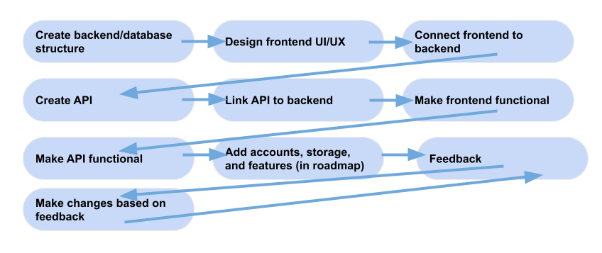

# OpenDocs

#### A WYSIWYG editor like Google Docs that supports Dyslexia, and as a bonus, custom fonts.

---

Table of Contents

1. [About](#about)
2. [Installation](#installation)
3. [Roadmap](#roadmap)

---

### About

OpenDocs is a 100% open-source editor like Word and Google Docs that aims to support people with Dyslexia.\
It does this through the availibility of custom fonts and typefaces to make readibility easier.\
OpenDocs will allow people to collaborate in real-time, as well as providing a desktop experience for PC, Mac, and Linux users.\
OpenDocs aims to create an amazing experience for anyone, with special considerations taken into account for people with Dyslexia.\
It will allow you to upload your own fonts, pictures and assets to support your projects.

**OpenDocs was created for the 2022 Beaverton School District STEM Expo. Please be kind, as it was created by a 7th grader.**

***P.S.*** *Yes, we do accept criticism, and I can handle a lot of it. Just try to be nice. If you have any questions, comments, or suggestions, feel free to create an issue on our GitHub.*

### Installation

<!-- tabs:start -->

#### **Cloud-Hosted**
1. Navigate to [https://docs.nosadnile.net/](https://docs.nosadnile.net/)
2. Create an account.
3. Create a new document.
4. Have fun!
#### **Docker**
1. Install Docker
    - Debian/Ubuntu/Kali Linux
        1. Open a terminal.
        2. Uninstall all old Docker versions.
            - `sudo apt-get remove docker docker-engine docker.io containerd runc`
            - It's okay if that command fails, saying it can't find `docker-engine`, so if that happens, run this: `sudo apt-get remove docker docker.io containerd runc`
        3. Run: `curl -fsSL https://get.docker.com | sudo bash`
    - MacOS
        1. Download Docker Desktop.
            - Mac with Intel chip: [https://desktop.docker.com/mac/main/amd64/Docker.dmg](https://desktop.docker.com/mac/main/amd64/Docker.dmg)
            - Mac with Apple chip: [https://desktop.docker.com/mac/main/arm64/Docker.dmg](https://desktop.docker.com/mac/main/arm64/Docker.dmg)
    - Windows
        1. Download Docker Desktop from [here](https://desktop.docker.com/win/main/amd64/Docker%20Desktop%20Installer.exe).
        2. Install Docker Desktop.
2. Install Docker Compose
    - Debian/Ubuntu/Kali Linux
        1. Open a terminal.
        2. Run
        ```
        sudo curl -L "https://github.com/docker/compose/releases/download/1.29.2/docker-compose-$(uname -s)-$(uname -m)" -o /usr/local/bin/docker-compose.
        ```
        3. Run `sudo chmod +x /usr/local/bin/docker-compose`.
    - MacOS/Windows
        - Docker Compose comes pre-installed with Docker Desktop. You can skip this step.
3. Create `docker-compose.yml` with this content:
```yaml
version: "3.9"
services:
    redis:
        image: redstonewizard/redis
        networks:
            - opendocs-net
    mongo:
        image: mongo
        networks:
            - opendocs-net
    opendocs:
        image: ghcr.io/opendocs-editor/docker:main
        networks:
            - opendocs-net
        ports:
            - 4500:4500
        environment:
            MONGODB_URI: mongodb://mongo:27017
            REDIS_URI: redis://redis:6379
 
networks:
    opendocs-net:
```
4. Run `docker-compose up -d`
5. Go to [http://localhost:4500](http://localhost:4500)
#### **Self-Hosted**
1. Clone this repository.
    - Run `git clone https://github.com/opendocs-editor/server.git`
2. Open a terminal.
3. Install NPM/Node.js and Yarn
    - Debian/Ubuntu/Kali Linux
        1. Open a terminal
        2. Run `sudo apt-get update && sudo apt-get -y upgrade`
        3. Run `sudo apt-get install npm`
        4. Run `sudo npm install --global n`
        5. Run `sudo n 17`
        6. Open a new terminal
        7. Run `sudo npm install --global yarn`
    - MacOS
        1. Open a terminal
        2. Install Homebrew
            - Run
            ```zsh
            /bin/bash -c "$(curl -fsSL https://raw.githubusercontent.com/Homebrew/install/HEAD/install.sh)"
            ```
        3. Open a new terminal
        4. Run `brew update`
        5. Run `brew doctor`
        6. Run `export PATH="/usr/local/bin:$PATH"`
        7. Run `brew install node`
        8. Run `npm install --global yarn`
        9. Run `node -v`
        10. Make sure that the output of the above command looks like `17.x.x`.
    - Windows
        1. Install Node.js
            - On 64-bit systems:
                1. Download the installer from [here](https://nodejs.org/dist/v17.3.0/node-v17.3.0-x64.msi).
                2. Run the installer. It should be the file `node-v17.3.0-x64.msi`.
            - On 32-bit systems:
                1. Download the installer from [here](https://nodejs.org/dist/v17.3.0/node-v17.3.0-x86.msi).
                2. Run the installer. It should be the file `node-v17.3.0-x86.msi`.
        2. Install Yarn
            1. Download the installer from [here](https://classic.yarnpkg.com/latest.msi).
            2. Run the installer. It should be the file `latest.msi`.
4. Install MongoDB.
    - Debian/Ubuntu/Kali Linux
        1. Open a terminal
        2. Run `sudo apt-get update && sudo apt-get -y upgrade`
        3. Run `wget -qO - https://www.mongodb.org/static/pgp/server-5.0.asc | sudo apt-key add -`
            - If this gives you an error, run `sudo apt-get -y install gnupg` and try to run the command again.
        4. Run 
        ```
        echo "deb [ arch=amd64,arm64 ] https://repo.mongodb.org/apt/ubuntu focal/mongodb-org/5.0 multiverse" | sudo tee /etc/apt/sources.list.d/mongodb-org-5.0.list
        ```
        5. Run `sudo apt-get update && sudo apt-get -y upgrade` again.
        6. Run `sudo apt-get install -y mongodb-org`
        7. Run `sudo systemctl daemon-reload`
        8. Run `sudo systemctl enable --now mongod`
    - MacOS
        1. Install XCode
        2. Open a terminal
        3. Run `xcode-select --install`
        4. Run `brew tap mongodb/brew`
        5. Run `brew install mongodb-community@5.0`
        6. Run `brew services start mongodb-community@5.0`
    - Windows
        1. Download the installer from [here](https://fastdl.mongodb.org/windows/mongodb-windows-x86_64-5.0.5-signed.msi).
        2. Run the installer. It should be the file `mongodb-windows-x86_64-5.0.5-signed.msi`.
5. Move into the working directory.
    - Run `cd ~/opendocs`
6. Install the dependencies.
    - Run `yarn install`
7. Start the server.
    - Run `yarn test`
8. Browse to the server!
    1. Head to [http://localhost:4500/](http://localhost:4500/)
    2. Have fun!

<!-- tabs:end -->

### Roadmap

<!-- tabs:start -->

#### **Checklist**

- [x] **~~Accounts~~**
- [ ] Cloud storage
- [ ] WYSIWYG Editor
- [ ] Live collaboration
- [ ] Live chat for collaboration
- [ ] Comments
- [x] **~~Formatting~~**
- [ ] Fonts
- [ ] Cloud documents explorer
- [ ] Export to Word, PDF, and image
- [ ] Add-on API
- [ ] Decentralize with Docker and Docker Compose

#### **Diagram**



<!-- tabs:end -->